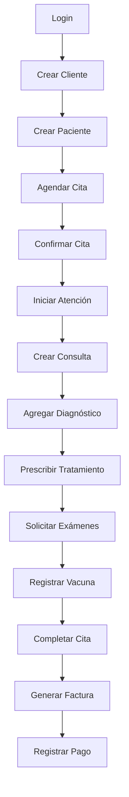

# 📬 Colección de Postman - API Veterinaria

Colección completa con **172 endpoints** para probar toda la API del Sistema de Gestión Veterinaria.

## 📦 Archivos Incluidos

1. **Veterinaria_API.postman_collection.json** - Colección parcial con los 3 módulos principales (Auth, Clientes, Pacientes)
2. **Veterinaria_Environment.postman_environment.json** - Variables de entorno
3. **API_ENDPOINTS_GUIDE.md** - Documentación completa de TODOS los 172 endpoints con ejemplos

## 🚀 Instalación

### 1. Importar en Postman

#### Opción A: Desktop App
1. Abre Postman Desktop
2. Click en **Import** (botón arriba a la izquierda)
3. Arrastra los archivos JSON o haz click en **Upload Files**
4. Importa ambos archivos:
   - `Veterinaria_API.postman_collection.json`
   - `Veterinaria_Environment.postman_environment.json`

#### Opción B: Postman Web
1. Ve a [Postman Web](https://go.postman.co/)
2. Sigue los mismos pasos

### 2. Configurar Environment

1. En Postman, ve a **Environments** (icono de ojo arriba a la derecha)
2. Selecciona **Veterinaria - Local**
3. Verifica que las variables estén configuradas:
   ```
   baseUrl: http://localhost:8080/api
   authToken: (se llenará automáticamente después del login)
   ```

## 🔧 Configuración Inicial

### 1. Iniciar el Backend

Asegúrate de que el backend Spring Boot esté corriendo:

```bash
cd /home/ksp/IdeaProjects/pn-veterinaria
./mvnw spring-boot:run
```

Verifica que esté activo:
```bash
curl http://localhost:8080/api/auth/ping
```

### 2. Primer Login

1. Ve a la carpeta **01 - Authentication** en Postman
2. Ejecuta el request **Login** con las credenciales por defecto:
   ```json
   {
     "email": "admin@veterinaria.com",
     "password": "admin123"
   }
   ```
3. El token JWT se guardará automáticamente en las variables de entorno
4. Todos los demás endpoints usarán este token automáticamente

## 📋 Orden Recomendado de Pruebas

### Flujo Básico (Happy Path)

```
1. Authentication/Login
   ↓
2. Clientes/Crear Cliente
   ↓
3. Pacientes/Crear Paciente (usar clienteId del paso 2)
   ↓
4. Citas/Crear Cita (usar pacienteId del paso 3)
   ↓
5. Consultas/Crear Consulta
   ↓
6. Diagnósticos/Crear Diagnóstico
   ↓
7. Tratamientos/Crear Tratamiento
   ↓
8. Facturas/Crear Factura
```

### Flujo Completo de Atención



## 🎯 Ejemplos de Uso

### Ejemplo 1: Crear un Cliente y su Mascota

```bash
# 1. Login
POST /auth/login
{
  "email": "admin@veterinaria.com",
  "password": "admin123"
}
# Guarda el clienteId de la respuesta

# 2. Crear Cliente
POST /v1/clientes
{
  "nombre": "María",
  "apellido": "González",
  "dni": "12345678",
  "email": "maria@example.com",
  "telefono": "+34912345678",
  "direccion": "Calle Principal 123",
  "ciudad": "Madrid"
}
# Respuesta: { "id": 1, ... }

# 3. Crear Paciente
POST /v1/pacientes
{
  "nombre": "Luna",
  "especie": "GATO",
  "raza": "Siamés",
  "fechaNacimiento": "2020-05-10",
  "sexo": "HEMBRA",
  "clienteId": 1  // <- ID del cliente creado
}
```

### Ejemplo 2: Agendar y Completar una Cita

```bash
# 1. Crear Cita
POST /v1/citas
{
  "pacienteId": 1,
  "veterinarioId": 1,
  "fechaCita": "2024-02-20",
  "horaCita": "10:00:00",
  "motivo": "Vacunación"
}

# 2. Confirmar Cita
PATCH /v1/citas/1/confirmar

# 3. Iniciar Atención
PATCH /v1/citas/1/iniciar

# 4. Completar Cita
PATCH /v1/citas/1/completar
```

### Ejemplo 3: Consulta Completa con Diagnóstico y Tratamiento

```bash
# 1. Crear Historial (si no existe)
POST /v1/historiales-clinicos/paciente/1

# 2. Crear Consulta
POST /v1/consultas
{
  "historialClinicoId": 1,
  "veterinarioId": 1,
  "citaId": 1,
  "fechaConsulta": "2024-02-20T10:00:00",
  "motivo": "Revisión anual",
  "anamnesis": "Paciente activo, comiendo bien",
  "examenFisico": "Temperatura: 38.5°C"
}

# 3. Agregar Diagnóstico
POST /v1/consultas/1/diagnosticos
{
  "tipoDiagnostico": "CLINICO",
  "descripcion": "Estado de salud normal",
  "gravedad": "LEVE",
  "principal": true
}

# 4. Prescribir Tratamiento
POST /v1/consultas/1/tratamientos
{
  "tipoTratamiento": "MEDICAMENTO",
  "descripcion": "Antiparasitario",
  "medicamento": "Ivermectina",
  "dosis": "1ml",
  "frecuencia": "Dosis única",
  "fechaInicio": "2024-02-20"
}
```

## 🔐 Autenticación

### Token JWT
- El token se obtiene en `/auth/login`
- Se guarda automáticamente en `{{authToken}}`
- Se envía en cada request: `Authorization: Bearer {{authToken}}`
- Válido por 24 horas (configurable)

### Renovar Token
Si el token expira (401 Unauthorized), simplemente vuelve a ejecutar el Login.

## 📊 Variables de Entorno

### Variables Automáticas
Estas se guardan automáticamente al crear entidades:
- `authToken` - Token JWT (después del login)
- `clienteId` - ID del último cliente creado
- `pacienteId` - ID del último paciente creado
- `citaId` - ID de la última cita creada
- `consultaId` - ID de la última consulta creada
- `facturaId` - ID de la última factura creada

### Variables Manuales
Estas las puedes editar según necesites:
- `baseUrl` - URL base de la API
- Todos los IDs si quieres usar valores específicos

### Cambiar Variables
1. Click en el icono de ojo (👁️) arriba a la derecha
2. Click en el environment activo
3. Edita las variables en **CURRENT VALUE**

## 🧪 Testing Automático

La colección incluye **test scripts** que:

### En Login:
```javascript
// Guarda el token automáticamente
if (pm.response.code === 200) {
    pm.environment.set("authToken", jsonData.token);
}
```

### En Crear Cliente/Paciente/etc:
```javascript
// Guarda el ID de la entidad creada
if (pm.response.code === 201) {
    pm.environment.set("clienteId", jsonData.id);
}
```

## 📝 Módulos Disponibles

| # | Módulo | Endpoints | Estado |
|---|--------|-----------|--------|
| 1 | Authentication | 7 | ✅ En colección |
| 2 | Clientes | 12 | ✅ 10/12 en colección |
| 3 | Pacientes | 16 | ✅ 14/16 en colección |
| 4 | Citas | 18 | 📄 Solo en documentación |
| 5 | Consultas | 14 | 📄 Solo en documentación |
| 6 | Diagnósticos | 11 | 📄 Solo en documentación |
| 7 | Tratamientos | 15 | 📄 Solo en documentación |
| 8 | Exámenes | 20 | 📄 Solo en documentación |
| 9 | Vacunas | 15 | 📄 Solo en documentación |
| 10 | Historial Clínico | 9 | 📄 Solo en documentación |
| 11 | Facturas | 18 | 📄 Solo en documentación |
| 12 | Usuarios | 13 | 📄 Solo en documentación |
| 13 | Razas | 18 | 📄 Solo en documentación |
| 14 | Tipos de Servicio | 8 | 📄 Solo en documentación |

**Total: 172 endpoints documentados**

## 🆘 Solución de Problemas

### Error: Could not get any response
**Causa**: El backend no está corriendo
**Solución**: Inicia Spring Boot
```bash
./mvnw spring-boot:run
```

### Error: 401 Unauthorized
**Causa**: Token expirado o inválido
**Solución**: Ejecuta el Login nuevamente

### Error: 403 Forbidden
**Causa**: El usuario no tiene permisos
**Solución**: Usa una cuenta con permisos (admin@veterinaria.com)

### Error: 404 Not Found
**Causa**: El endpoint o recurso no existe
**Solución**: Verifica la URL y que el ID exista

### Error: 500 Internal Server Error
**Causa**: Error en el servidor
**Solución**: Revisa los logs del backend

### Token no se guarda automáticamente
1. Ve a Settings en Postman
2. Desactiva **SSL certificate verification**
3. Vuelve a ejecutar el Login

## 🔗 Recursos Adicionales

- **Documentación Swagger**: http://localhost:8080/swagger-ui.html
- **API Docs (OpenAPI)**: http://localhost:8080/v3/api-docs
- **Guía Completa de Endpoints**: Ver archivo `API_ENDPOINTS_GUIDE.md`
- **Repositorio Backend**: `/home/ksp/IdeaProjects/pn-veterinaria`

## 📞 Soporte

Si encuentras algún problema:
1. Verifica que el backend esté corriendo
2. Revisa los logs del backend
3. Consulta la documentación Swagger
4. Revisa el archivo `API_ENDPOINTS_GUIDE.md`

## 🎉 ¡Listo!

Ya puedes empezar a probar la API. Recuerda:
1. **Siempre** hacer Login primero
2. Usar las variables de entorno `{{clienteId}}`, `{{pacienteId}}`, etc.
3. Consultar `API_ENDPOINTS_GUIDE.md` para ver TODOS los endpoints disponibles

---

**Creado para**: Sistema de Gestión Veterinaria
**Versión**: 1.0.0
**Última actualización**: 2024
